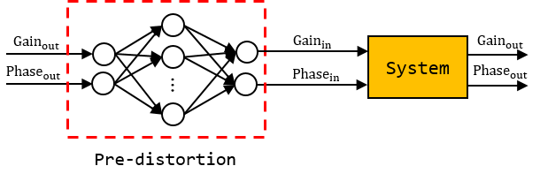

# Beamforming Chip Calibration using a Neural Network

**본 과제는 과학기술정보통신부에서 시행한 정보통신,방송연구개발사업의 결과입니다.**

This project aims to calibrate the beamforming chip system that has two inputs and two outputs using a fully connected neural network. The system has two inputs, inputgain and inputphase, both ranging from 0 to 31. It has two outputs, outputgain and outputphase. Outpuggain's unit is dB and outputphase's unit is degree. 

The neural network has two inputs, outputgain and outputphase, and it outputs two values, which are the inputs of the system that will output, in the end, outputgain and outputphase. The network pre-distorts the inputs in order to get the correct outputs in the end.

  

calibration_tf.ipynb shows the system achieves 84% of accuracy when 400 data are used for training and 122 data are used for testing. The same approach can be applied in IQ mismatch calibration.
